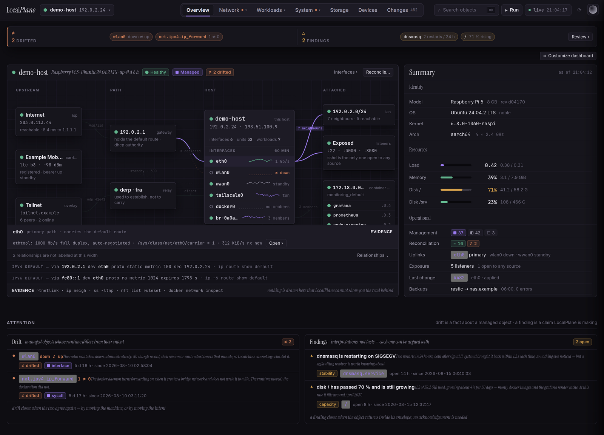
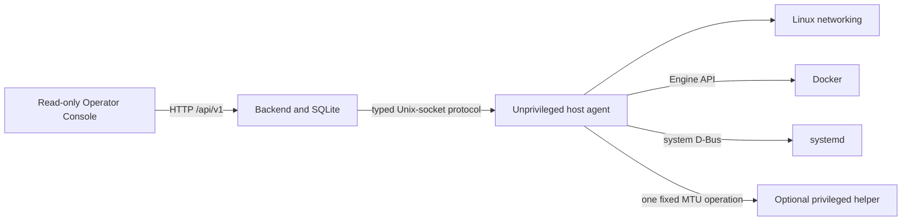

<div align="center">

<br>
<br>
<br>

<picture>
  <source media="(prefers-color-scheme: dark)" srcset="docs/images/localplane-wordmark-dark.svg">
  <source media="(prefers-color-scheme: light)" srcset="docs/images/localplane-wordmark-light.svg">
  
</picture>

<br>
<br>

**Observe everything. Manage what you choose.**

<br>

A local-first operations control plane for understanding Linux systems and making guarded,
evidence-backed changes.

<br>

</div>

> [!IMPORTANT]
> **Early development / pre-release.** LocalPlane is not production-ready. Its APIs, data
> model, packaging, and deployment requirements may change.

> [!WARNING]
> **Local use only.** Authentication is designed but not implemented. The backend binds to
> loopback by default and must not be exposed to an untrusted network. Anyone who can reach
> the API can read host information and request the supported mutations.

LocalPlane turns provider facts into an operational model: identity, observation, evidence,
ownership, intent, findings, Runs, Changes, verification, recovery, and history. It respects
the system that owns each fact. Missing, stale, or incomplete evidence remains `unknown`;
LocalPlane does not convert uncertainty into a reassuring answer.

Linux is the first deeply supported platform, not the permanent conceptual boundary.



*V4.2 is product and interface direction, not a screenshot of the current application and
not a feature matrix. The implemented Operator Console is read-only and covers a subset of
these surfaces.*

## Current capabilities

| Domain | Observation | Management |
| --- | --- | --- |
| Linux networking | Interfaces, addresses, link state, provider evidence, ownership, intent, reconciliation, provenance, and request-scoped route evidence | Adopt/release an eligible interface, revise retained intent, and reconcile the MTU of a managed interface |
| Docker | Containers, runtime state, configuration, ports, mounts, networks, health, bounded logs, and current statistics | Start, stop, or restart one validated container through the Docker Engine API |
| systemd | A bounded loaded-unit estate, unit state, enablement, typed relationships, service/socket/timer detail, lifecycle evidence, and LocalPlane containment | Start, stop, or restart one eligible loaded service through systemd's D-Bus API |
| Operational records | Observations, evidence, findings, Runs, Changes, verification, recovery, and history | Execute only a published and confirmed typed plan through the shared write path |

The backend has seven host-mutation operation types:

- `network.interface.reconcile_mtu`
- `docker.container.start`, `docker.container.stop`, `docker.container.restart`
- `systemd.service.start`, `systemd.service.stop`, `systemd.service.restart`

There is no generic command, shell, arbitrary Docker request, general D-Bus execution,
terminal, or provider passthrough surface.

The React/Vite Operator Console shows host overview, networking, workloads, systemd,
topology, Runs, Changes, and findings. It sends no record-writing or host-writing requests
and renders no Start, Stop, Restart, Apply, Adopt, or intent-revision controls.

## How a change works

```text
observe and collect evidence
  -> plan
  -> publish an immutable preview
  -> confirm
  -> execute through the owning provider
  -> observe again through the ordinary read path
  -> verify
  -> recover or hold for an operator when the outcome cannot be proved
```

A **Run** is the request and plan for one typed operation. A **Change** begins only when
execution enters a path on which a host write may occur; it is not proof that a write
occurred. Kernel, Docker, or systemd acceptance is not verified success. LocalPlane takes a
fresh observation and evaluates the evidence required by that operation.

## Architecture at a glance



The agent observes provider facts and executes closed provider operations. The backend owns
the operational judgements, persistence, plans, Runs, Changes, and HTTP API. The optional
helper exposes one privileged MTU mutation and is not a general root broker.

Docker daemon access is a privileged deployment boundary. On a typical rootful Docker host,
access to its Unix socket is effectively root-equivalent even when the agent process UID is
not root.

## Documentation

- [Architecture](docs/architecture.md) — current components, authority boundaries, and
  deployment topology
- [Product model](docs/product-model.md) — objects, evidence, ownership, intent, Runs,
  Changes, and unknown state
- [Safety model](docs/safety-model.md) — write boundaries, protection, verification, and
  recovery
- [API and topology](docs/api-and-topology.md) — API domains, refresh semantics, and
  evidence-backed relationships
- [Project status](docs/project-status.md) — current, foundational, accepted, future, and
  unresolved work
- [Development](docs/development.md) — local setup, validation, contracts, and repository
  layout
- [Operator Console](web/README.md) — frontend behavior and development commands

## Quick start

Requirements: Linux and Python 3.11 or newer. Docker and systemd support depend on the host
and the agent's available provider permissions.

```sh
python3 -m venv .venv
.venv/bin/pip install -e '.[dev]'
```

Start the agent and backend in separate terminals:

```sh
.venv/bin/localplane-agent
```

```sh
.venv/bin/localplane-backend
```

The backend listens on `127.0.0.1:8080` by default. Interactive API documentation is at
`http://127.0.0.1:8080/docs`; the generated contract is at
`http://127.0.0.1:8080/openapi.json`.

The privileged helper is not needed for observation or Docker/systemd lifecycle actions.
It is needed for the MTU write and requires an explicit peer UID or GID allowlist. See
[Development](docs/development.md#optional-privileged-helper) before enabling it.

## Direction and limits

LocalPlane's current foundation is single-host and Linux-first. The longer-term direction is
a coherent control plane for systems, networks, workloads, and applications that preserves
provider-specific semantics while unifying evidence, relationships, operations,
verification, recovery, and history.

That direction is non-promissory. Host exploration beyond the implemented domains, unified
logs and metrics, storage, packages, first-class applications, fleet operation, automation,
and terminal access are not current capabilities. See [Project status](docs/project-status.md)
for the authoritative classification.

## Licence

LocalPlane is licensed under the [Apache License 2.0](LICENSE). Third-party font notices and
licence text are recorded in [NOTICE](NOTICE).
