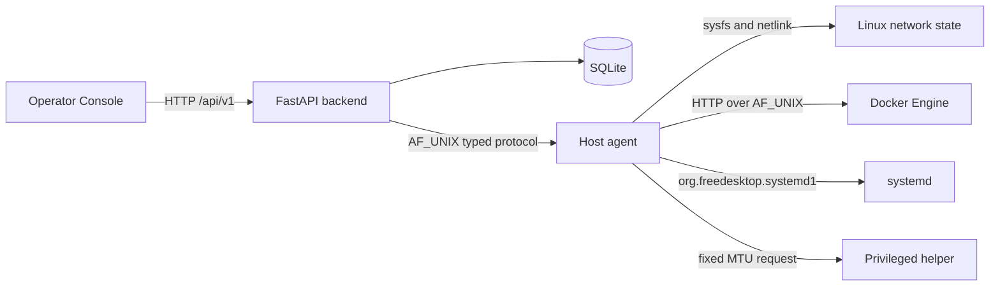
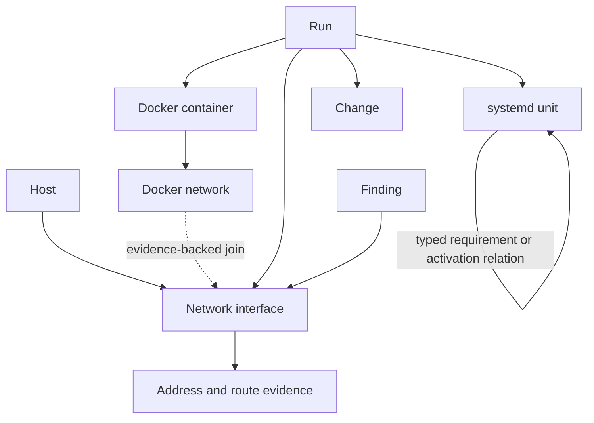

# API and topology

[Back to the repository overview](../README.md)

The HTTP API exposes LocalPlane's normalized operational model. It does not provide generic
access to provider protocols, and this document does not duplicate the generated schema.

For exact paths, request bodies, response fields, and enums, use the committed
[OpenAPI snapshot](../web/openapi.json) or run the backend and open `/docs`.

## Current topology

The console calls `/api/v1` on its own origin. In development, Vite proxies `/api` to the
loopback backend because the backend has no CORS middleware. The proxy is a development
convenience, not a security boundary.

## API domains

| Domain | Purpose |
| --- | --- |
| Status, host, agent | Backend status, host identity, agent state, and probed capabilities |
| Network | Stored interfaces, evidence, provenance, protection, intent, reconciliation, and refresh |
| Docker | Stored containers plus explicit refresh, bounded log reads, and current statistics |
| systemd | Stored loaded units plus explicit bounded inventory refresh |
| Management path | Request-scoped connection/route evidence and stored protection context |
| Observations | Sweep history and completeness |
| Findings | Durable drift and ownership-conflict records |
| Runs | Create, inspect, preview, confirm, apply, keep a guard, cancel, and grant a bounded self-impact override |
| Changes | Inspect mutation history and confirm, retry, or resolve recovery |

The current committed contract contains 43 paths and 44 operations. Those counts describe
this pre-release snapshot, not a compatibility guarantee.

## Reads, observations, and records

Most `GET` routes read stored state and never contact the host. Provider observation is
explicit so a response can distinguish a stored fact from a new read:

- `POST /network/observations/refresh`
- `POST /docker/containers/observations/refresh`
- `POST /systemd/observations/refresh`
- `POST /management-path/observations/refresh`

Container logs and statistics also use `POST`; they sample Docker on demand and write
nothing. `GET /agent/capabilities` is the notable exception to store-only GET behavior: it
performs a handshake and records LocalPlane capability evidence, but it does not mutate the
host.

Adoption, release, intent revision, Run creation/confirmation/cancellation, recovery
confirmation/resolution, and the self-impact override change LocalPlane records only.

Only `POST /runs/{id}/apply` and `POST /changes/{id}/recovery/retry` can result in a host
write. See the [safety model](safety-model.md).

## Object and relationship topology

Relationships use authoritative identifiers and typed provider evidence. Docker bridge
relationships join on network IDs and published IPAM/link evidence, not display names.
systemd preserves distinctions between requirements, ordering, conflicts, activation, and
outcome handling. Ordering is not treated as dependency.

A target may be current, referenced but not observed, external to the bounded inventory, or
unresolved. The API retains that distinction instead of fabricating a complete graph.

## Console coverage

The current console consumes the integrated contract for overview, network, Docker,
systemd, management-path evidence, sweeps, findings, Runs, and Changes. It intentionally
binds no record-writing or host-writing endpoints. Its topology renders only relationships
supported by API evidence and states when a source could not be read.

The V4.2 image in the repository overview includes directional surfaces with no current
contract. It must not be used to infer API or topology support.

## Contract workflow

`web/openapi.json` is the committed backend snapshot and
`web/src/api/schema.d.ts` is generated from it. When the backend contract changes, refresh
both from the same running backend and review the pair together. Commands and safety notes
are in [Development](development.md#openapi-and-generated-types).
