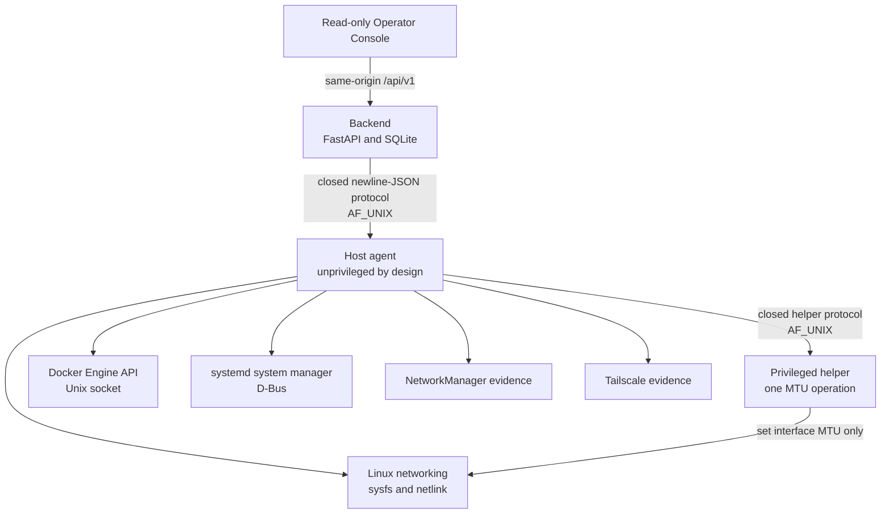
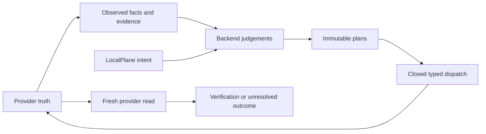

# Architecture

[Back to the repository overview](../README.md)

LocalPlane is an early, single-host control plane. Its current architecture keeps provider
access, operational judgement, persistence, and privilege in separate components.

## Current component topology

### Operator Console

The console is a React/Vite client of the HTTP API. It has no direct connection to the
agent, helper, Docker, systemd, or the host. The current client binds read endpoints only.
Two Docker sampling requests use `POST` because they contact the daemon; they do not write
host or LocalPlane records.

### Backend

The backend owns:

- the HTTP API and public representations;
- normalized objects, observations, intent, findings, Runs, and Changes;
- ownership, management, protection, health, freshness, and reconciliation judgements;
- planning, confirmation, execution eligibility, verification, and recovery state;
- the SQLite store and its numbered, checksummed migrations.

Provider state is not copied into a second authoritative mirror. LocalPlane persists what it
observed, the evidence behind it, and LocalPlane's own intent and history.

### Agent

The agent owns host-facing provider adapters and ephemeral host handles. It reports facts
and typed outcomes; it does not decide whether an operation is allowed. Its public protocol
has a closed method vocabulary and bounded messages.

Provider integration follows the provider's authoritative interface where available:

- Docker through the Docker Engine HTTP API on a Unix socket;
- systemd through `org.freedesktop.systemd1` on the system D-Bus;
- Linux network observation through sysfs and netlink, with a bounded route query;
- NetworkManager and Tailscale as evidence sources for ownership/provenance.

There is no caller-selectable command, argv, Docker endpoint, D-Bus destination, object
path, member, signature, or arbitrary provider method.

### Privileged helper

The helper is a separately versioned boundary for one fixed kernel mutation: setting an
interface MTU. It validates peer credentials before parsing a request and exposes no shell,
executable path, arbitrary arguments, or general network administration primitive.

Docker access is different: the agent talks directly to the daemon. A rootful Docker socket
is effectively a host-authority boundary and must be treated as privileged deployment
access, even though it is not held by the helper.

## Authority boundaries

Providers remain authoritative for the facts they own. LocalPlane is authoritative for its
own intent, records, policy decisions, and audit history. The interface between them is
typed rather than reduced to a generic resource action.

## Current request and observation model

Stored `GET` routes normally read the database and do not contact the host. Explicit refresh
routes contact providers and record observations. Docker logs and current statistics are
on-demand samples and are not stored as a metrics or log database.

One exception matters: `GET /api/v1/agent/capabilities` performs an agent handshake and
records capability evidence. It changes LocalPlane records but never the host.

## Current deployment boundary

The backend binds to loopback by default and fails closed without a restrictively stored master
credential. API callers use that credential as a Bearer token. Browsers exchange it once for a
random, in-memory session whose raw token is delivered only in an `HttpOnly`, `SameSite=Strict`
cookie. Cookie-authenticated unsafe requests require an exact accepted `Origin`; Bearer requests
are Origin-exempt. Sessions expire absolutely after 12 hours and are invalidated by restart.

This remains a single-process, loopback-development topology. TLS configuration, reverse-proxy
trust, remote browser access, and production asset serving are not implemented. The Operator
Console is not a remotely deployable security boundary.

The accepted security design requires the operator's TCP connection to terminate in the
backend so management-path evidence comes from the accepted socket. A reverse proxy must not
be treated as an accepted terminator for that connection. Exact production asset delivery
and TLS ownership remain unresolved.

## Extension model

The current subsystem seam is a closed operation registry, not a general plugin system.
Network, Docker, and systemd keep provider-specific models and operations while sharing the
Run/Change, evidence, verification, and history grammar. New providers should add thin,
typed adapters and reuse that core without forcing unlike resources into a lowest-common-
denominator action API.
