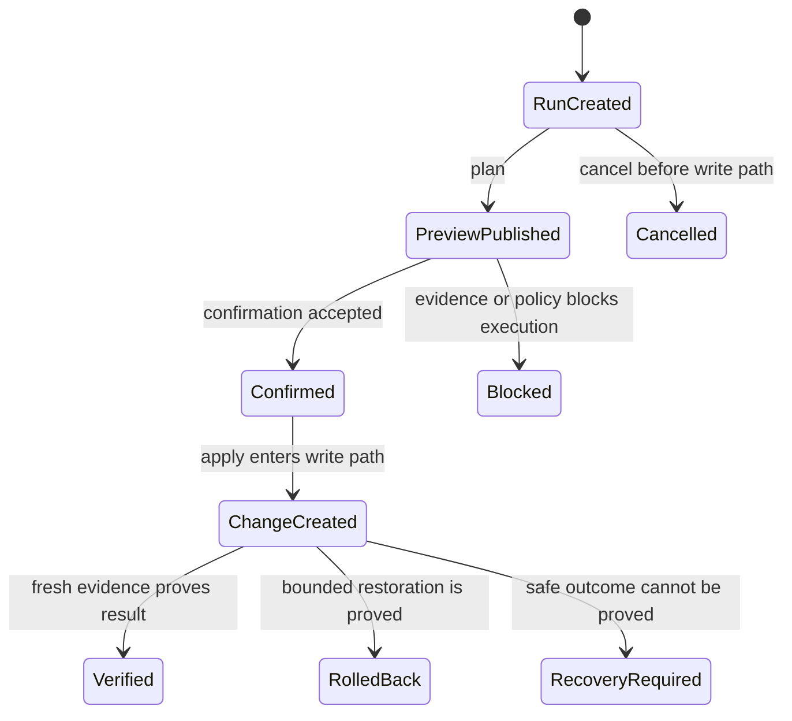

# Product model

[Back to the repository overview](../README.md)

LocalPlane models operational truth as related claims with explicit evidence. A single
"status" field cannot answer who owns an object, whether LocalPlane manages it, whether it
is healthy, whether it has drifted, or whether changing it is safe.

## Objects and identity

An object is a resource LocalPlane can identify and observe. Current object kinds are Linux
network interfaces, Docker containers, and loaded systemd units.

Identity is grounded in the authoritative source for each kind: host identity plus the
kernel interface identity, Docker's container ID, or systemd's canonical `Unit.Id`. Names,
PIDs, timestamps, D-Bus paths, and visual grouping are evidence or presentation, not
substitutes for identity.

## Independent state axes

| Axis | Question |
| --- | --- |
| Management | Is the object observe-only, observed, or explicitly managed by LocalPlane? |
| Ownership | Which provider created it, and which provider configures it now? |
| Protection | What could changing it put at risk? |
| Reconciliation | Does retained intent match the newest readable controlled fields? |
| Health | What condition does current evidence support? |
| Freshness | Is the observation current enough for the claim being made? |

These axes do not collapse into one another. A managed object can be unhealthy; an observed
object can be healthy; an externally configured object can be unprotected; an in-sync object
can still be down.

## Observation, evidence, and unknown

An observation records what a provider reported at a point in time. Evidence records the
source, scope, completeness, and gaps behind the claim. Provenance describes relations such
as `created_by` and `configured_by`; it is never inferred from a resource name alone.

`unknown` is an answer, not an error value. It is used when evidence is missing, partial,
stale, changing, ambiguous, or unsupported. In particular:

- an unread controlled value is not drift;
- absent provider evidence is not proof of no owner;
- an unresolved management path is not proof that an object is safe to change;
- an unavailable optional property is not given a fabricated default.

## Management and intent

Discovery does not automatically make an object managed. Management has three values:

- `observe_only` — LocalPlane can report the object but does not offer adoption;
- `observed` — LocalPlane observes it and may offer an explicit management transition;
- `managed` — LocalPlane is answerable for a declared, field-scoped intent.

Adoption and release are explicit transitions. Revising intent is a different operation: it
replaces one immutable intent version with another without touching the host. Declaring the
observed runtime correct is also an intent revision, not a successful reconciliation.

Current retained intent and reconciliation apply to eligible network-interface fields. A
Docker container remains provider-owned; LocalPlane acts through Docker's lifecycle API
without claiming configuration ownership of the container.

## Findings

A state is a current interpretation. A finding is a durable claim that deserves operator
attention and carries a lifecycle: when it was first established, when it was last seen, and
how it was resolved. Current findings cover drift and ownership conflicts. Missing evidence
does not automatically become an incident.

## Runs, plans, and Changes

A **Run** is a request to plan one closed typed operation. Its preview is immutable and
content-addressed. Planning may be useful even when execution is blocked because it explains
the evidence, risk, confirmation, and missing proof.

A **Change** is created only when an apply or recovery retry enters a path on which a host
write may occur. It says the boundary was crossed, not that a write happened. Mutation
outcome therefore remains separate:

- `not_written` — LocalPlane can prove no provider write was accepted;
- `written` — the provider accepted the mutation;
- `write_unknown` — a write may have happened, but the dispatch outcome cannot be proved.

Verification is another independent result. A provider acknowledgement is not success;
fresh evidence must prove the operation's declared end state.

## Field changes and actions

The Change Engine supports two shapes:

- a **field change** moves one controlled value toward retained intent and may have a
  checkpoint, rollback, or connection guard;
- an **action** asks an owning provider for a typed lifecycle transition and states the
  required end state.

Actions are not forced into a fake before/after field model. A container or service restart,
for example, needs evidence of a new execution, not merely evidence that the object is still
running.

## Relationships and topology

Relationships are published only when supported by provider evidence or deterministic joins
over authoritative identifiers. Current examples include interface/address/route evidence,
Docker container/network relations, systemd requirements and activation relations, and
LocalPlane containment. Unobserved, external, or unresolved targets retain those meanings;
the model does not invent placeholder objects to make a graph look complete.
