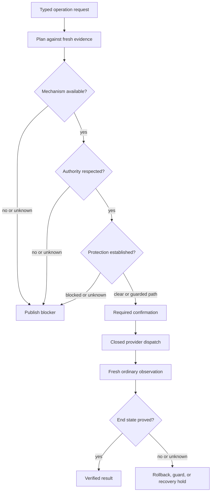

# Safety model

[Back to the repository overview](../README.md)

LocalPlane's safety model is built around closed operations, explicit authority, fresh
evidence, truthful uncertainty, and a durable record of what can and cannot be proved.

## Current write surface

The backend exposes many record and observation routes, but only two HTTP endpoints can
result in a host write:

- `POST /api/v1/runs/{run_id}/apply`
- `POST /api/v1/changes/{change_id}/recovery/retry`

Neither accepts a body. The target, operation, desired end state, provider, and evidence are
already fixed by the Run or Change. There is no generic execute route.

Seven operation types dispatch through three provider mechanisms: one MTU operation through
the helper, three container lifecycle actions through Docker, and three service lifecycle
actions through systemd.

## Layered gates

Capability, authorization, ownership, protection, confirmation, and verification answer
different questions. Availability never implies permission; authentication never proves an
operation is safe; and an accepted mutation never proves the intended result.

## Closed operations and privilege

Every operation name and target shape is a closed vocabulary. Caller input cannot select a
shell command, executable, Docker endpoint, D-Bus method, unit object path, netlink field,
or privileged-helper primitive.

The helper exposes only interface MTU mutation and validates Unix peer credentials before
parsing. systemd lifecycle uses the Unit object's `Start`, `Stop`, or `Restart` method with
the mode fixed internally to `fail`; PolicyKit decides authorization at dispatch. Docker
lifecycle uses the Engine API and a validated container identity.

Docker socket access remains a broad host-authority boundary in a rootful deployment. The
narrow helper does not reduce the authority already carried by that socket.

## Management-path protection

For an operator connection, LocalPlane derives the accepted TCP peer and local endpoint from
the socket itself. It does not trust forwarded headers, body fields, or query parameters as
connection evidence. A kernel route query and current observations must agree on the object
carrying that path.

If the path is unresolved, protection is `unknown` for every candidate object and execution
stays blocked. Absence of proof is never treated as proof that an object is off the path.

An eligible MTU change on the proven management interface may use a connection guard. The
agent arms a bounded host-side reversal before the write. A later request must arrive over
the changed path to keep the change; otherwise the guard attempts its compare-and-set
reversal. Only fresh evidence can prove the final state.

Systemd lifecycle planning also evaluates whether a service's bounded effect graph contains
the operator path, the LocalPlane agent, or the backend runtime. Partial, changing, or
unsupported graph evidence stays `unknown` and blocks. A narrowly defined, single-use
self-impact override exists only for one proven backend interruption hazard; it does not
rewrite protection truth or substitute for the ordinary confirmation.

Container lifecycle does not yet prove whether a particular container carries the
operator's route. This is an unresolved safety limitation, separate from authentication.

## Verification and uncertain outcomes

Dispatch completion is evidence, not verified success. LocalPlane observes through the
ordinary provider path after a mutation:

- MTU reconciliation verifies the intended value;
- container start/stop verifies runtime state;
- container restart also verifies a new Docker start record;
- service start/stop verifies active state;
- service restart also requires a changed systemd `InvocationID`.

If dispatch began and the answer is lost, the mutation outcome is `write_unknown`. Reading
the desired value later cannot prove whether LocalPlane's write caused it. An unresolved
outcome ends in `recovery_required` and holds the object's write lock.

Recovery is append-only. A retry first observes and writes only if the required end state is
not already proved and fresh authority permits another attempt. A manual resolution releases
the hold without touching the host. Neither rewrites the original Change's history.

## Authentication boundary

Authentication is implemented and deliberately separated from operation safety:

- a one-shot local command creates one 256-bit master credential in a restrictive file;
- normal startup fails closed rather than generating or replacing that credential;
- CLI and automation use it as a Bearer credential verified with constant-time comparison;
- a browser presents it once to create a separate random, 12-hour, non-sliding in-memory session;
- only the SHA-256 session-token hash and absolute expiry remain server-side;
- the browser receives the raw session token only in an `HttpOnly`, `SameSite=Strict`, host-only cookie;
- cookie-authenticated POST, PUT, PATCH, and DELETE require an exact accepted `Origin`;
- bearer-authenticated requests are Origin-exempt, and an explicit invalid Bearer never falls back to a cookie;
- authentication is applied at the FastAPI router boundary, including documentation and OpenAPI.

There is one credential and no user, role, RBAC, named identity, password database, or persistent
session store. New confirmation records say `authenticated_request`; that states only that the
request crossed this boundary. Historical `unauthenticated_request` evidence is retained unchanged.
The Operator Console remains read-only. Authentication cannot waive planning, preview binding,
confirmation, protection, provider authority, helper/systemd authorization, verification, recovery,
or write locks.

## Deployment constraints

The backend binds to loopback by default. Plain-HTTP browser sessions are issued only for that
configured loopback topology. Non-loopback browser exposure still requires a separately accepted
HTTPS/TLS topology that preserves authoritative connection evidence. Production asset serving is
unresolved, so LocalPlane remains local development software.
